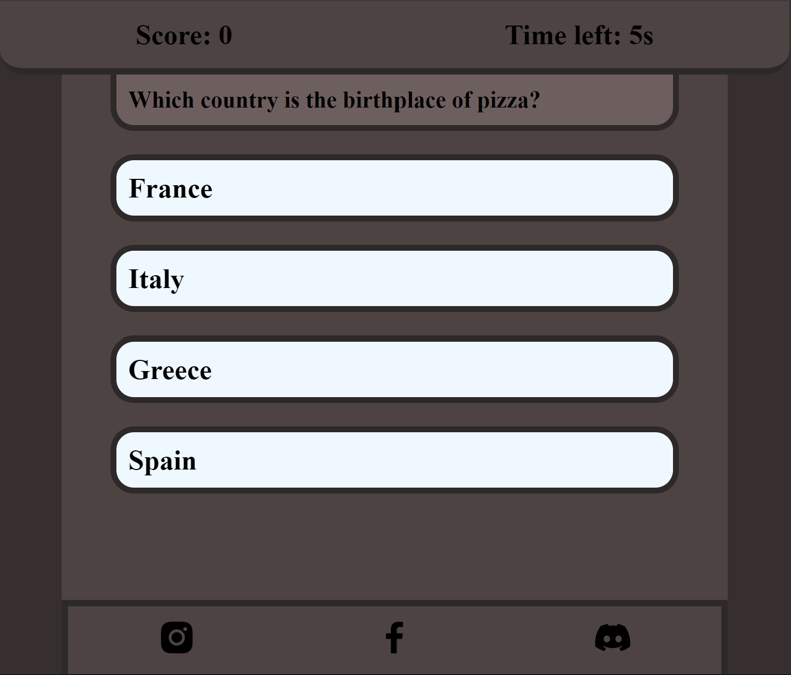

<h1 align="center">GuessIt</h1>
Welcome to GuessIt, webApp-game where you can test your knowledge in different areas, beat your and your friend record! 

The GuessIt site is live, please [CLICK HERE](https://zellyboba1.github.io/PP2/) to check the website.

## Tabel of Contents
- [Tabel of Contents](#tabel-of-contents)
- [UX](#ux)
  - [Site Purpose](#site-purpose)
  - [Audience](#audience)
  - [Communication](#communication)
  - [Current User Goals](#current-user-goals)
  - [New User Goals](#new-user-goals)
- [Design](#design)
  - [Colour Scheme](#colour-scheme)
  - [Typography](#typography)
  - [Imagery](#imagery)
- [Features](#features)
  - [Existing Features](#existing-features)
    - [Landing Section](#landing-section)
    - [Leaderboard Section](#leaderboard-section)
    - [Guide Section](#guide-section)
    - [Game Section](#game-section)
    - [Social Links](#social-links)
  - [Future Features](#future-features)
- [Testing](#testing)
  - [Validator Testing](#validator-testing)
  - [Unfixed Bugs](#unfixed-bugs)
- [Technologies Used](#technologies-used)
  - [Main Languages Used](#main-languages-used)
  - [Frameworks, Libraries \& Programs Used](#frameworks-libraries--programs-used)
- [Deployment](#deployment)
  - [How to deploy](#how-to-deploy)
  - [How to clone](#how-to-clone)
- [Credits](#credits)
  - [Content](#content)
  - [Acknowledgements](#acknowledgements)

## UX

### Site Purpose
The purpose of GuessIt is to provide an easy-to-understand webApp-game for people who wants to test their knowledge.

### Audience
GuessIt welcomes everyone. Young or old, GuessIt is intuitive for everyone.

### Communication
Simpe animated design for better user experience.

### Current User Goals
- To test their knowledge and to get the highest score

### New User Goals
- Easy navigation, understandable for new users

## Design

### Colour Scheme
The colour palette was created by [Coolors](https://coolors.co) with four colors from black to white, the main idea is to make simple pallete.

### Typography
"Open Sans" "Pixelify Sans" "Sans-serif" was picked, these fonts looks good and simple and supported by most browsers

### Imagery
All the images(screenshots) was made by me

## Features

### Existing Features

#### Landing Section
Minimalistic landing page, which provides user all the information about the game

#### Leaderboard Section
Leaderboard section allows user to see his record and will display other people records in the future

#### Guide Section
Simple guide menu, which tells user how to play the game

#### Game Section
Main section on the webApp with minimalistic design, that contains the quiz

Game section contains five containers, one container with question and four answers, where only one is rigt

#### Social Links
Simple footer with a bunch of social links, where user can find posts about webApp and ask questions

### Future Features
- New design, based on user improvement comments
- Updated leaderboard which will display 10 best scores

## Testing
  - Tested all social links, everything works fine 
  - Tested game, wrong answers turns red on click, and right answers turns green
  - The website pages tested and they are responsive with all screen sizes.

### Validator Testing
- JS (By using [JSHint validator](https://jshint.com/))

  -  Result for script.js

     

- HTML (By using [W3C validator](https://validator.w3.org/))

  -  Result for index.html

     
  
   

- CSS (By using [Jigsaw validator](https://jigsaw.w3.org/css-validator/))

  - Result for style.css

     
  

### Unfixed Bugs

## Technologies Used
### Main Languages Used
- JavaScript
- HTML5
- CSS3

### Frameworks, Libraries & Programs Used
- VS-Code - simple programing enviroment
- GitHub - cloud service to store reposiory
- boxicons.com - all my social icons I took from this site

## Deployment
### How to deploy
- The site was deployed to GitHub pages. The steps to deploy are as follows:
- In the GitHub repository, navigate to the Settings tab
- From the source section drop-down menu, select the main Branch
- The live link can be found here - [GuessIt](https://zellyboba1.github.io/PP2/)

 ### How to clone
- Go to the following repository on GitHub: https://zellyboba1.github.io/PP2/
- At the top right of the screen, click the 'Code' button, and then click 'HTTPs'
- Copy the link in this field
- Open VS-code, creat new project folder, open the terminal
- On the terminal type "git clone", then paste the copied url and press 'Enter'
- The clone process should now begin

## Credits

### Content

- [W3Schools](https://www.w3schools.com/css/css3_mediaqueries.asp) - This website helped me to remember html and css structure, it was difficult to remember everything, and in the end of the project I was using this site less and less than in the begining 

- [YouTube](https://www.youtube.com/) - The most popular website with tons of educational videos, that helped me allot in this project, and will help in my future projects, there I found videos like "How to make your website responsive" and "Hamburger menu"

### Acknowledgements

- I would like to say thank you to my mentor Martina and my facilitator Marko which helped me allot through the project